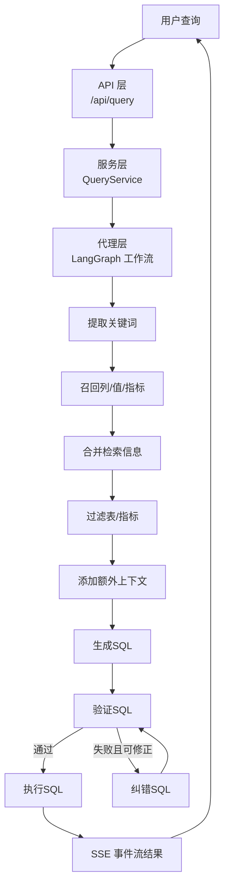

# Data Agent — Text-to-SQL 智能数据查询代理

将自然语言问题转换为 SQL 查询并返回结果的智能代理系统。基于 LangGraph 构建多节点工作流，结合向量检索、关键词召回与 LLM 推理，实现高精度的自然语言到 SQL 转换。

系统面向业务分析师提供零 SQL 基础的自助查询能力，同时为数据科学家与开发者提供快速数据探索与可扩展的智能查询平台。

---

## 核心功能

### 1. 自然语言理解与关键词提取

使用 jieba 中文分词对用户查询进行分词，基于词性白名单（名词、动词、形容词、成语等）筛选有效关键词，并保留原查询作为候补，去重后形成关键词集合，为后续召回提供语义基础。

### 2. 多源数据并行召回

并行触发三路召回，显著提升上下文完备性：
- **列信息召回**：LLM 扩展关键词 → 批量向量嵌入 → Qdrant 向量搜索
- **指标信息召回**：LLM 扩展关键词 → 批量向量嵌入 → Qdrant 向量搜索
- **字段取值召回**：LLM 扩展关键词 → Elasticsearch 全文/倒排检索

各路召回结果异步聚合去重后，交由下游节点处理。

### 3. 智能 SQL 生成

基于过滤后的上下文（表信息、指标信息、日期信息、数据库信息）构造结构化提示词，调用 LLM 生成可执行 SQL。上下文以 YAML 格式序列化传入，确保语义一致性。

### 4. SQL 验证与自动纠错

- **验证阶段**：对生成的 SQL 执行 `EXPLAIN`，检查语法与执行计划可行性
- **纠错阶段**：验证失败时，将错误信息与上下文传入 LLM 生成修正 SQL
- **重试保护**：最多 2 轮纠错，超过上限终止并返回错误，避免无限循环
- **安全限制**：仅允许 `SELECT` 语句，结果集大小受限，防止危险操作

### 5. SSE 流式结果输出

全链路采用 async/await + SSE 流式传输，前端可实时展示每个步骤的进度与耗时：
```
提取关键字 → 召回字段/指标/取值 → 过滤表/指标 → 生成SQL → 验证SQL → 执行SQL → 返回结果
```

---

## 技术栈

| 组件 | 技术 |
|------|------|
| Web 框架 | FastAPI |
| Agent 框架 | LangGraph + LangChain |
| LLM | DeepSeek API |
| 向量数据库 | Qdrant |
| 全文检索 | Elasticsearch 8.x |
| 关系数据库 | MySQL（asyncmy + SQLAlchemy 2.0） |
| Embedding | HuggingFace（BAAI/bge-large-zh-v1.5） |
| 配置管理 | OmegaConf + YAML |
| 日志 | Loguru |
| 依赖管理 | uv |
| Python 版本 | ≥ 3.12 |

---

## 系统架构

系统采用 **API 层 → 服务层 → 代理编排层 → 数据访问层** 的分层设计：



### 分层职责

| 层级 | 职责 |
|------|------|
| **API 层** | REST 接口、请求追踪（Request-ID）、健康检查 |
| **服务层** | 构建上下文与状态、编排工作流、SSE 流式输出、超时控制 |
| **代理编排层** | LangGraph 状态机驱动的多节点流水线，条件分支与纠错循环 |
| **数据访问层** | 仓储模式封装 MySQL/Qdrant/ES 访问，客户端管理器统一连接池 |

---

## 快速开始

### 1. 环境准备

确保以下服务已启动：
- MySQL 8.x
- Qdrant（默认端口 6333）
- Elasticsearch 8.x（默认端口 9200）
- Embedding 服务（默认端口 8088，模型 `BAAI/bge-large-zh-v1.5`）

### 2. 安装依赖

```bash
# 安装 uv（如未安装）
pip install uv

# 创建虚拟环境并安装依赖
uv sync
```

### 3. 初始化数据库

依次执行 `sql/` 目录下的建表脚本：

```sql
-- 元数据库
sql/init_meta.sql
sql/init_meta_config.sql

-- 数据仓库（示例数据）
sql/init_dw.sql

-- 评估系统
sql/init_evaluation.sql
```

### 4. 配置应用

```bash
# 复制示例配置并填写实际连接信息
cp conf/app_config.example.yaml conf/app_config.yaml
```

编辑 `conf/app_config.yaml`，填入数据库密码、API Key 等敏感信息。

### 5. 构建元知识库

启动服务后，调用构建接口将元数据写入向量库：

```bash
curl -X POST http://localhost:8000/api/meta-config/build
```

### 6. 启动服务

```bash
uv run main.py
# 或
uvicorn main:app --host 0.0.0.0 --port 8000
```

访问 http://localhost:8000 可使用内置的调试页面。

---

## API 接口

### 查询接口

| 方法 | 路径 | 说明 |
|------|------|------|
| POST | `/api/query` | 自然语言查询，SSE 流式返回 |

### 元数据配置

| 方法 | 路径 | 说明 |
|------|------|------|
| GET/POST | `/api/meta-config/tables` | 表配置列表 / 新增 |
| GET/PUT/DELETE | `/api/meta-config/tables/{name}` | 单表查询 / 修改 / 删除 |
| GET/POST | `/api/meta-config/tables/{table_name}/columns` | 列列表 / 新增 |
| PUT/DELETE | `/api/meta-config/columns/{column_id}` | 列修改 / 删除 |
| GET/POST | `/api/meta-config/metrics` | 指标列表 / 新增 |
| PUT/DELETE | `/api/meta-config/metrics/{name}` | 指标修改 / 删除 |
| POST | `/api/meta-config/build` | 触发元知识库构建 |

### SQL 质量评估

| 方法 | 路径 | 说明 |
|------|------|------|
| GET/POST | `/api/evaluation/questions` | 标准问题集管理 |
| POST | `/api/evaluation/run` | 触发评估运行 |
| GET | `/api/evaluation/runs` | 查看运行记录 |
| GET | `/api/evaluation/runs/{run_id}` | 运行详情 |
| POST | `/api/evaluation/runs/{run_id}/retry/{question_id}` | 重试失败题目 |

### 系统

| 方法 | 路径 | 说明 |
|------|------|------|
| GET | `/health` | 健康检查（MySQL / Qdrant / ES） |

---

## 项目结构

```
nl2sql/
├── app/
│   ├── agent/          # LangGraph 工作流节点（召回、过滤、生成、纠错）
│   ├── api/            # FastAPI 路由层 & 请求/响应 Schema
│   ├── clients/        # 外部服务客户端管理器（MySQL/Qdrant/ES/Embedding）
│   ├── conf/           # 配置加载（OmegaConf）
│   ├── core/           # 基础设施（日志、生命周期、请求上下文）
│   ├── entities/       # 领域实体
│   ├── models/         # SQLAlchemy ORM 模型
│   ├── prompt/         # 提示词加载器
│   ├── repositories/   # 数据访问层（MySQL/ES/Qdrant）
│   ├── scripts/        # 脚本工具
│   └── services/       # 业务服务层
├── conf/
│   ├── app_config.example.yaml  # 应用配置示例（需复制后填写）
│   └── meta_config.yaml         # 元数据声明文件
├── prompts/            # LLM 提示词模板
├── sql/                # 数据库建表 & 初始化脚本
├── static/             # 静态文件（调试页面）
├── main.py             # 应用入口
└── pyproject.toml      # 依赖声明（uv）
```

---

## 配置说明

| 配置项 | 说明 |
|--------|------|
| `db_meta` | 元数据库连接（存储表/列/指标配置） |
| `db_dw` | 数据仓库连接（业务查询目标库） |
| `qdrant` | Qdrant 向量库连接 |
| `embedding` | 本地 Embedding 服务地址 |
| `es` | Elasticsearch 连接 |
| `llm` | LLM 接口配置（模型名、API Key、Base URL） |
| `logging` | 日志级别、轮转、保留策略 |

完整配置示例见 [`conf/app_config.example.yaml`](conf/app_config.example.yaml)。

---

## 查询示例

```
输入: "统计去年各地区的销售总额"

工作流:
  1. 关键词提取 → [去年, 地区, 销售, 总额]
  2. 并行召回 → 列: [region_name, order_amount]  指标: [GMV]  值: [华东, 华南...]
  3. 过滤表 → fact_order + dim_region
  4. 生成SQL → SELECT r.region_name, SUM(o.order_amount) AS total ...
  5. 验证SQL → EXPLAIN 通过
  6. 执行SQL → 返回结构化结果（SSE 流式）
```

---

## 性能特性

- **全链路异步**：async/await + 连接池，降低 I/O 等待开销
- **并行召回**：列/指标/取值三路召回使用 `asyncio.gather` 并发执行，显著降低延迟
- **批量嵌入**：多关键词一次性生成向量，减少 Embedding 服务往返次数
- **流式输出**：SSE 分块推送中间进度，提升前端感知性能
- **超时控制**：单次查询设超时阈值，避免长尾请求阻塞
- **安全限制**：SQL 仅允许 SELECT，结果集大小受限，防止资源滥用

---

## 故障排查

| 问题 | 排查方法 |
|------|----------|
| SQL 验证失败 | 检查数据仓库连接、表结构是否存在；确认生成的 SQL 符合目标数据库方言 |
| 查询超时 | 优化提示模板与检索策略；检查 Graph 节点耗时与数据库负载 |
| 结果为空 | 检查关键词扩展是否合理、召回阈值与去重策略 |
| 健康检查异常 | 访问 `/health` 查看各依赖连通性（MySQL / Qdrant / ES） |
| 流式输出中断 | 检查网络稳定性与 SSE 客户端兼容性 |

日志排查：每个请求带唯一 `X-Request-ID`（响应头），节点内记录步骤进度与耗时，可结合 `logs/app.log` 定位问题。

---

## License

MIT
