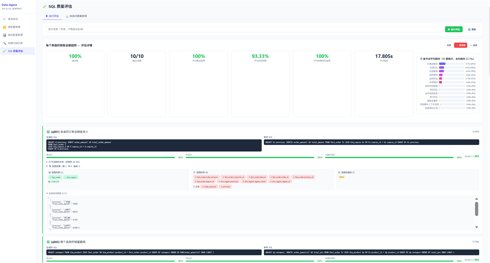
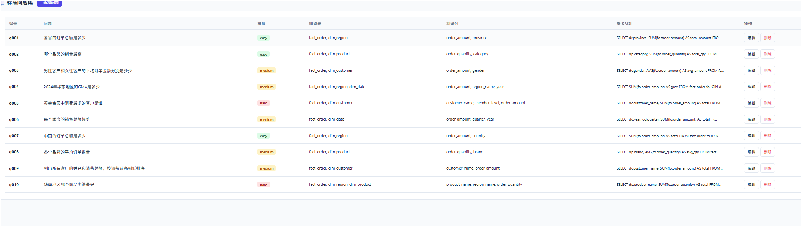
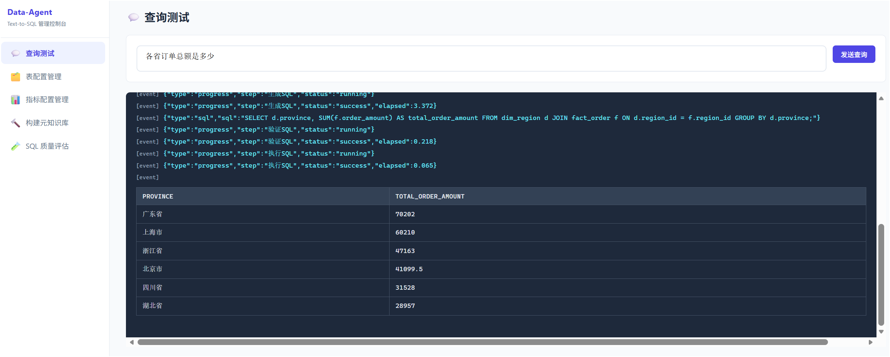
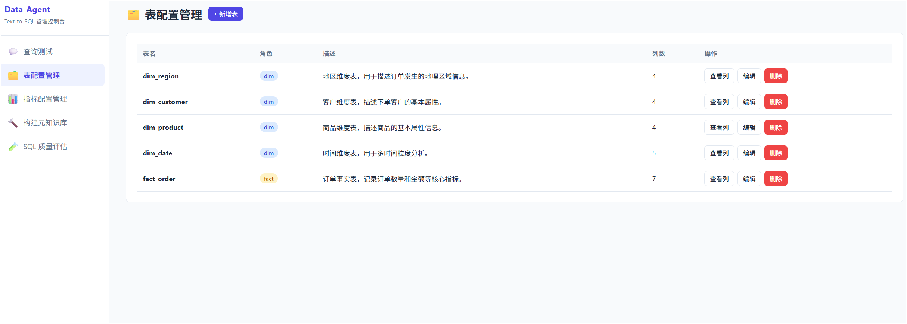
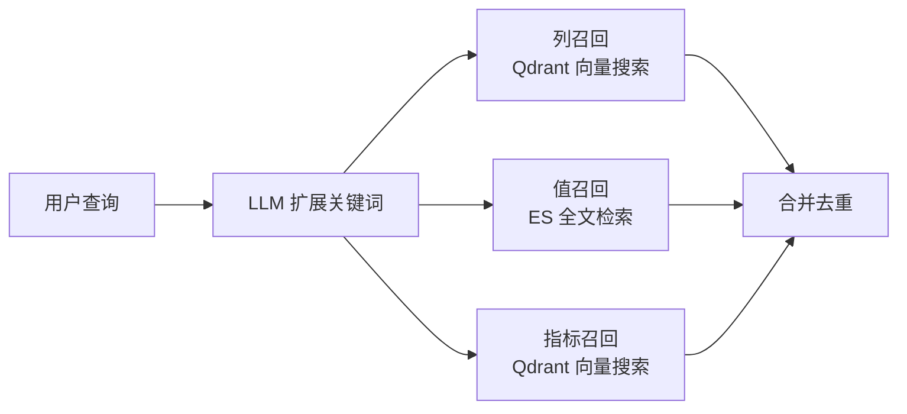
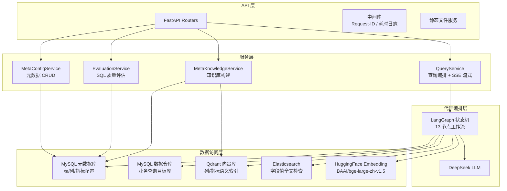
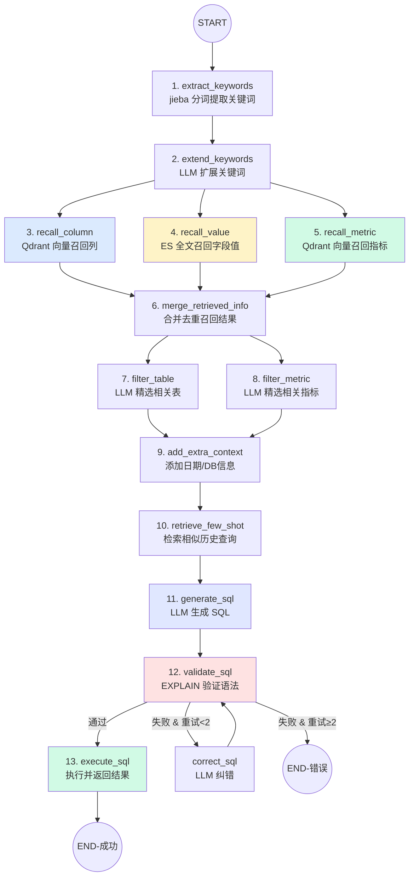
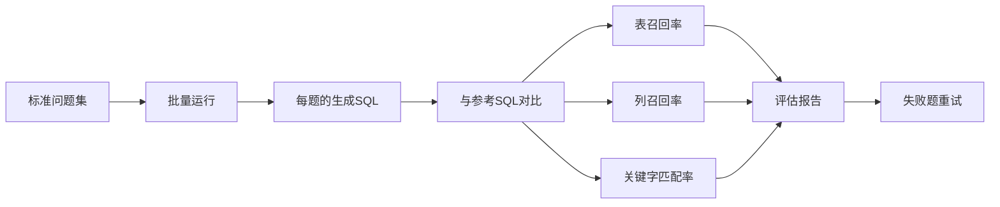

# Data Agent — Text-to-SQL 智能数据查询代理

<p align="center">
  <strong>🤖 自然语言 → SQL → 数据结果 | 全链路流式处理 | 多源并行召回 | LLM 自动纠错</strong>
</p>

<p align="center">
  
  
  
  
  
  
  
</p>

---

## 📖 目录

- [项目简介](#项目简介)
- [系统截图](#系统截图)
- [核心功能](#核心功能)
- [架构设计](#架构设计)
- [架构特点与优势](#架构特点与优势)
- [技术栈](#技术栈)
- [快速开始](#快速开始)
- [API 接口](#api-接口)
- [项目结构](#项目结构)
- [配置说明](#配置说明)
- [使用示例](#使用示例)
- [SQL 质量评估系统](#sql-质量评估系统)
- [管理控制台](#管理控制台)
- [下一步优化方向](#下一步优化方向)
- [故障排查](#故障排查)

---

## 项目简介

**Data Agent** 是一个基于 LangGraph 构建的 Text-to-SQL 智能数据查询代理系统。它将自然语言问题自动转换为 SQL 查询并返回结构化结果，支持 SSE 流式输出、多源并行召回、LLM 自动纠错以及完整的 SQL 质量评估体系。

系统面向三类用户场景：

| 用户角色 | 使用场景 |
|----------|----------|
| 🧑‍💼 **业务分析师** | 零 SQL 基础的自助数据查询，用自然语言提问获取数据 |
| 🔬 **数据科学家** | 快速数据探索与验证，减少手写 SQL 的时间成本 |
| 🛠️ **系统管理员** | 通过管理控制台配置元数据、管理知识库、运行质量评估 |

### 📌 项目定位

本项目旨在**技术沉淀与方案验证**，完整实现了 NL2SQL 从自然语言输入到 SQL 执行的核心链路。当前以最小可用原型（MVP）的方式呈现所有关键环节，为后续生产级系统建设提供参考基线。

### ⚠️ 生产化注意事项

当前系统聚焦于 NL2SQL 核心能力的实现，若需投入生产环境，至少需要补充以下能力：

| 需补充 | 说明 |
|--------|------|
| **接口鉴权** | 当前所有 API 均为开放访问，需要接入 JWT/OAuth2 等认证机制，实现用户登录与 Token 校验 |
| **数据权限** | 需要增加行级/列级数据权限控制，确保不同用户只能查询其授权范围内的数据（如租户隔离、部门隔离） |
| **接口权限** | 需要引入 RBAC/ABAC 权限模型，区分管理员、分析师、只读用户等角色的接口访问范围 |
| **SQL 安全加固** | 当前仅限制 SELECT，生产环境还需防范 SQL 注入、限制子查询深度、禁止跨库查询等 |
| **速率限制** | 需要增加用户级别的 QPS 控制，防止恶意或误操作导致数据库负载过高 |
| **审计日志** | 需要记录每次查询的用户、时间、原始问题、生成 SQL、执行结果，满足合规审计要求 |

---

## 系统截图

### 查询面板 — 自然语言 → SQL → 结果

<p align="center">
  
</p>

> 输入自然语言问题，系统实时展示每一步处理进度：关键词提取 → 并行召回 → 过滤上下文 → 生成 SQL → 验证 → 执行，全链路 SSE 流式输出。

### 元数据配置管理

<p align="center">
  
</p>

> 表/列/指标的 CRUD 管理界面，支持角色标注（维度/事实）、别名配置、向量同步控制。

### SQL 质量评估

<p align="center">
  
</p>

> 批量运行标准问题集，自动计算通过率、表召回率、列召回率、关键字匹配率，生成评估报告。

### 知识库构建

<p align="center">
  
</p>

> 一键构建元知识库，将表/列/指标的向量嵌入写入 Qdrant，为召回提供语义基础。

---

## 核心功能

### 1. 中文自然语言理解

使用 **jieba** 分词器对用户查询进行中文分词，基于词性白名单（名词、动词、形容词、成语等）筛选有效关键词，并保留原始查询作为候补，形成关键词集合：

```
用户输入: "统计去年各地区的销售总额"
     ↓
关键词提取: [去年, 地区, 销售, 总额]
```

### 2. 多源数据并行召回 🔀

三路召回**并发执行**，通过 `asyncio.gather` 聚合结果，显著提升上下文完备性：



| 召回类型 | 技术方案 | 说明 |
|----------|----------|------|
| **列召回** | LLM 扩展关键词 → BGE Embedding → Qdrant 向量相似度搜索 | 找到与查询语义相关的表列 |
| **值召回** | LLM 扩展关键词 → Elasticsearch 全文/倒排检索 | 找到字段中的具体取值（如"华东"） |
| **指标召回** | LLM 扩展关键词 → BGE Embedding → Qdrant 向量相似度搜索 | 找到匹配的业务指标（如 GMV） |

### 3. 上下文过滤与组装

对召回的列、指标进行 LLM 精排，过滤不相关项，防止上下文过长：

```
召回: 30+ 列, 15+ 指标
  → 过滤 → 保留 8 列, 3 指标
  → 添加日期信息、数据库方言信息
  → Few-shot 检索相似历史查询
  → 组装为结构化 Prompt
```

### 4. 智能 SQL 生成与 Few-Shot

- 基于过滤后的上下文（表信息、指标信息、日期信息、数据库信息）构造 YAML 格式结构化提示词
- 检索相似的历史查询示例作为 Few-Shot，提升生成质量
- 支持 MySQL 方言，理解常见查询模式

### 5. SQL 验证与自动纠错 🔄

```
            ┌──────────────┐
            │  Validate    │
            │  SQL         │
            └──┬───┬───┬───┘
         通过   │   │   失败 & 重试≥2次
               │   │        ↓
               │   │    ┌──────────┐
               │   └──→ │ Correct  │
               │   失败  │ SQL      │
               │   &重试 │ (LLM修正)│
               │   <2次  └────┬─────┘
               │             │
               ↓             ↓ (回到验证)
          ┌──────────┐
          │ Execute  │
          │ SQL      │
          └──────────┘
```

- **验证阶段**：对生成的 SQL 执行 `EXPLAIN`，检查语法与执行计划可行性
- **纠错阶段**：将错误信息与上下文传入 LLM 生成修正 SQL
- **重试保护**：最多 2 轮纠错，超过上限终止并返回错误
- **安全限制**：仅允许 `SELECT` 语句，结果集大小受限

### 6. SSE 流式输出

全链路采用 `async/await` + SSE（Server-Sent Events）流式传输，前端实时展示每一步进度：

```
[提取关键字] → 耗时 0.01s
[扩展关键词] → 耗时 8.20s
[召回字段取值] → 耗时 0.05s
[检索相似示例] → 耗时 0.00s
[生成SQL] → 耗时 3.56s
[验证SQL] → 耗时 0.00s
[执行SQL] → 耗时 0.00s
→ 返回结构化结果
```

---

## 架构设计

### 分层架构

系统采用 **4 层架构**，层间通过依赖注入解耦：



### LangGraph 工作流（13 节点完整流程）



> **关键设计**：节点 3/4/5 三路并行执行（`asyncio.gather`），节点 7/8 并行过滤，验证→纠错循环最多 2 轮。

### 状态管理

工作流状态 `DataAgentState` 贯穿所有节点，以 TypedDict 定义，确保类型安全：

| 状态字段 | 类型 | 阶段 |
|----------|------|------|
| `query` | `str` | 输入 |
| `keywords` | `list[str]` | 关键词提取后 |
| `column/value/metric_keywords` | `list[str]` | LLM 扩展后 |
| `retrieved_columns/values/metrics` | `list[Entity]` | 三路召回后 |
| `table_infos / metric_infos` | `list[TypedDict]` | 过滤后 |
| `few_shot_examples` | `list[dict]` | 检索后 |
| `sql` | `str` | 生成后 |
| `error` | `str \| None` | 验证失败时 |
| `correct_count` | `int` | 纠错计数器 |

---

## 架构特点与优势

### 🏗️ 工程化设计

| 特点 | 说明 |
|------|------|
| **分层解耦** | API → Service → Agent → Repository 四层架构，每层职责清晰，可独立测试 |
| **依赖注入** | FastAPI `Depends()` 组装依赖链，Repository 在 `__init__` 中注入底层客户端 |
| **仓储模式** | Repository 抽象数据访问，MySQL/Qdrant/ES 各自封装，业务层不感知存储细节 |
| **实体模型分离** | Entity（领域实体）与 Model（ORM 模型）分离，通过 Mapper 转换，避免数据库耦合 |

### ⚡ 性能优化

| 特点 | 说明 |
|------|------|
| **全链路异步** | `async/await` + 异步连接池（asyncmy / aioodrant），零阻塞等待 |
| **三路并行召回** | 列/值/指标使用 `asyncio.gather` 并发执行，召回阶段延迟降至单路的 1/3 |
| **批量向量嵌入** | 多关键词一次性生成 Embedding，减少 HTTP 往返 |
| **SSE 流式输出** | 分块推送中间进度，首字节时间 < 1s，提升体感性能 |
| **LRU 缓存** | Prompt 模板加载使用 LRU 缓存，减少文件 I/O |
| **连接池复用** | 单例客户端管理器，统一连接池生命周期，避免频繁建连/断连 |

### 🤖 LLM 调用策略与优化空间

当前工作流中，**关键词扩展**（3 路召回各自扩展）和**表/指标过滤**阶段会多次调用 LLM：

```
extend_keywords
  ├── 列召回扩展 (LLM 调用 1)
  ├── 值召回扩展 (LLM 调用 2)
  └── 指标召回扩展 (LLM 调用 3)

filter_table   (LLM 调用 4)
filter_metric  (LLM 调用 5)
generate_sql   (LLM 调用 6)
```

| 项目 | 说明 |
|------|------|
| **当前设计** | 每个环节独立调用 LLM，使用较大模型（DeepSeek-Chat），追求推理准确度 |
| **优化方向 1** | 将多次扩展关键词调用合并为一次 LLM 调用，同时产出列/值/指标三组扩展词，减少 LLM 往返次数 |
| **优化方向 2** | 将表过滤 + 指标过滤合并为一次调用，上下文一次传入，减少 Token 消耗 |
| **优化方向 3** | 扩展关键词、过滤等非核心生成环节切换为更小/更快的模型（如 DeepSeek-Lite、Qwen-7B），仅 SQL 生成使用强模型 |
| **设计权衡** | 当前拆分为多次独立调用的主要原因是**让模型每次专注一个推理任务，提升准确率**；合并后可显著降低延迟，但需要验证准确率是否下降 |

### 🛡️ 安全与可靠性

| 特点 | 说明 |
|------|------|
| **SQL 白名单** | 仅允许 `SELECT` 语句，杜绝 INSERT/UPDATE/DELETE/DROP 等危险操作 |
| **结果集限流** | 查询结果行数受控，防止大结果集 OOM |
| **超时控制** | 单次查询设超时阈值，避免长尾请求阻塞工作流 |
| **自动纠错** | SQL 语法错误时 LLM 自动修正，最多 2 轮，避免死循环 |
| **Request-ID 追踪** | 每个请求携带唯一 ID，全链路日志可追溯 |
| **健康检查** | `/health` 端点实时检测 MySQL/Qdrant/ES 连通性 |

### 🧪 质量保障

| 特点 | 说明 |
|------|------|
| **SQL 质量评估** | 内置 10 题标准问题集，自动执行并计算通过率、召回率 |
| **多维度指标** | 表召回率、列召回率、关键字匹配率，全方位衡量生成质量 |
| **失败原因分类** | `sql_error` / `execution_error` / `low_recall` 三级分类，便于定位问题 |
| **节点级耗时** | 记录每个工作流节点的耗时，支持性能瓶颈分析 |
| **评估报告** | 汇总页展示通过率、平均延迟、失败原因分布，一目了然 |

### 🔧 可维护性

| 特点 | 说明 |
|------|------|
| **Prompt 外部化** | 所有 LLM 提示词模板存放在 `prompts/*.prompt` 文件中，修改无需改代码 |
| **类型安全配置** | OmegaConf + Dataclass，配置项有类型约束和 IDE 自动补全 |
| **结构化日志** | Loguru + `request_id` 自动注入，每行日志可关联到具体请求 |
| **元数据管理面板** | Web UI 管理表/列/指标配置，支持别名、角色、同步控制 |
| **数据库迁移脚本** | `sql/` 目录包含建表和迁移脚本，版本化管理 |

---

## 技术栈

| 组件 | 技术选型 | 说明 |
|------|----------|------|
| Web 框架 | **FastAPI** + SSE | 异步 Web 框架，原生支持流式响应 |
| Agent 框架 | **LangGraph** + LangChain | 状态图编排，支持条件分支与循环 |
| LLM | **DeepSeek**（OpenAI 兼容协议） | 中文理解能力强，性价比高 |
| 向量数据库 | **Qdrant** | 高性能向量相似度搜索 |
| 全文检索 | **Elasticsearch 8.x** | 字段值倒排索引，中文分词检索 |
| 关系数据库 | **MySQL 8.x**（asyncmy + SQLAlchemy 2.0） | 元数据存储 + 业务数据仓库 |
| Embedding | **BAAI/bge-large-zh-v1.5**（HuggingFace） | 中文语义向量模型，1024 维 |
| 中文分词 | **jieba** | 精准中文分词与词性标注 |
| 配置管理 | **OmegaConf** + Dataclass | 类型安全，支持环境变量插值 |
| 日志 | **Loguru** | 结构化日志，自动注入 request_id |
| 依赖管理 | **uv** | 快速 Python 包管理器 |
| Python | ≥ 3.12 | 类型注解、异步原生支持 |

---

## 快速开始

### 前置依赖

确保以下服务已启动并可访问：

| 服务 | 默认端口 | 用途 |
|------|----------|------|
| MySQL 8.x | 3306 | 元数据存储 + 数据仓库 |
| Qdrant | 6333 | 向量相似度检索 |
| Elasticsearch 8.x | 9200 | 全文检索 |
| Embedding 服务 | 8088 | HuggingFace BGE 模型推理 |

### 1. 安装依赖

```bash
# 安装 uv（如未安装）
pip install uv

# 创建虚拟环境并安装依赖
uv sync
```

### 2. 初始化数据库

按顺序执行建表脚本：

```bash
# 1. 元数据库（表/列/指标信息存储）
mysql -u root -p < sql/init_meta.sql

# 2. 元数据配置库（用户自定义表/列/指标 CRUD）
mysql -u root -p < sql/init_meta_config.sql

# 3. 数据仓库（示例业务数据：订单、客户、商品、地区、日期）
mysql -u root -p < sql/init_dw.sql

# 4. 评估系统（标准问题集 + 评估记录）
mysql -u root -p < sql/init_evaluation.sql
```

### 3. 配置文件

```bash
# 复制示例配置
cp conf/app_config.example.yaml conf/app_config.yaml

# 编辑配置，填入实际连接信息
vim conf/app_config.yaml
```

关键配置项：

```yaml
# 元数据库（存储表/列/指标配置）
db_meta:
  host: localhost
  port: 3306
  user: root
  password: ${env:DB_META_PASSWORD}  # 支持环境变量

# 数据仓库（业务查询目标库）
db_dw:
  host: localhost
  port: 3306
  user: root
  password: ${env:DB_DW_PASSWORD}

# LLM 配置
llm:
  model: deepseek-chat
  api_key: ${env:LLM_API_KEY}
  base_url: https://api.deepseek.com

# Qdrant 向量库
qdrant:
  host: localhost
  port: 6333

# Elasticsearch
es:
  host: localhost
  port: 9200

# Embedding 服务
embedding:
  host: localhost
  port: 8088
```

### 4. 构建元知识库

启动服务后，将元数据写入向量库和 ES：

```bash
# 先启动服务
uv run main.py

# 另一个终端执行构建
curl -X POST http://localhost:8000/api/meta-config/build
```

### 5. 启动服务

```bash
# 方式一：直接启动
uv run main.py

# 方式二：使用 uvicorn
uvicorn main:app --host 0.0.0.0 --port 8000 --reload
```

访问 **http://localhost:8000** 打开管理控制台。

---

## API 接口

### 自然语言查询

| 方法 | 路径 | 说明 |
|------|------|------|
| `POST` | `/api/query` | 自然语言查询，**SSE 流式返回** |

```bash
# 请求示例
curl -X POST http://localhost:8000/api/query \
  -H "Content-Type: application/json" \
  -d '{"query": "各省的订单总额是多少"}'

# 响应（SSE 流）
# data: {"type":"node","node":"提取关键字","data":{"keywords":["各省","订单","总额"]}}
# data: {"type":"node","node":"生成SQL","data":{"sql":"SELECT ..."}}
# data: {"type":"result","data":[{"province":"广东省","total":70202},...]}
# data: {"type":"done"}
```

### 元数据配置管理

| 方法 | 路径 | 说明 |
|------|------|------|
| `GET` | `/api/meta-config/tables` | 获取所有表配置 |
| `POST` | `/api/meta-config/tables` | 新增表配置 |
| `GET` | `/api/meta-config/tables/{name}` | 获取单表详情（含列） |
| `PUT` | `/api/meta-config/tables/{name}` | 更新表配置 |
| `DELETE` | `/api/meta-config/tables/{name}` | 删除表配置 |
| `POST` | `/api/meta-config/tables/{name}/columns` | 新增列配置 |
| `PUT` | `/api/meta-config/columns/{id}` | 更新列配置 |
| `DELETE` | `/api/meta-config/columns/{id}` | 删除列配置 |
| `GET` | `/api/meta-config/metrics` | 获取所有指标 |
| `POST` | `/api/meta-config/metrics` | 新增指标 |
| `PUT` | `/api/meta-config/metrics/{name}` | 更新指标 |
| `DELETE` | `/api/meta-config/metrics/{name}` | 删除指标 |
| `POST` | `/api/meta-config/build` | **构建元知识库** |

### SQL 质量评估

| 方法 | 路径 | 说明 |
|------|------|------|
| `GET` | `/api/evaluation/questions` | 获取标准问题集 |
| `POST` | `/api/evaluation/questions` | 新增标准问题 |
| `DELETE` | `/api/evaluation/questions/{id}` | 删除标准问题 |
| `POST` | `/api/evaluation/run` | **触发评估运行** |
| `GET` | `/api/evaluation/runs` | 查看运行记录列表 |
| `GET` | `/api/evaluation/runs/{id}` | 运行详情（含每题结果） |
| `POST` | `/api/evaluation/runs/{id}/retry/{qid}` | 重试单个失败题目 |

### 系统

| 方法 | 路径 | 说明 |
|------|------|------|
| `GET` | `/health` | 健康检查（MySQL / Qdrant / ES 连通性） |
| `GET` | `/` | 管理控制台页面 |

---

## 项目结构

```
nl2sql/
├── main.py                          # FastAPI 应用入口
├── pyproject.toml                   # 项目元数据与依赖声明
├── uv.lock                          # 依赖锁定文件
│
├── app/
│   ├── agent/                       # 🔄 LangGraph 工作流引擎
│   │   ├── graph.py                 #   状态图定义（13 节点 + 条件边）
│   │   ├── state.py                 #   工作流状态（TypedDict）
│   │   ├── context.py               #   运行时上下文（Repository 注入）
│   │   ├── llm.py                   #   LLM 客户端封装
│   │   └── nodes/                   #   13 个工作流节点
│   │       ├── extract_keywords.py  #     1. jieba 分词
│   │       ├── extend_keywords.py   #     2. LLM 扩展关键词
│   │       ├── recall_column.py     #     3. Qdrant 列召回
│   │       ├── recall_value.py      #     4. ES 值召回
│   │       ├── recall_metric.py     #     5. Qdrant 指标召回
│   │       ├── merge_retrieved_info.py #  6. 合并去重
│   │       ├── filter_table.py      #     7. LLM 表过滤
│   │       ├── filter_metric.py     #     8. LLM 指标过滤
│   │       ├── add_extra_context.py #     9. 附加上下文
│   │       ├── retrieve_few_shot.py #     10. Few-shot 检索
│   │       ├── generate_sql.py      #     11. LLM 生成 SQL
│   │       ├── validate_sql.py      #     12. EXPLAIN 验证
│   │       ├── correct_sql.py       #     纠错节点（验证失败时触发）
│   │       └── execute_sql.py       #     13. 执行并返回
│   │
│   ├── api/                         # 🌐 FastAPI 接口层
│   │   ├── dependencies.py          #   依赖注入组装
│   │   ├── routers/
│   │   │   ├── query_router.py      #   查询接口
│   │   │   ├── meta_config_router.py #  元数据配置接口
│   │   │   └── evaluation_router.py #   SQL 评估接口
│   │   └── schemas/                 #   请求/响应 Pydantic Schema
│   │
│   ├── services/                    # 🧠 业务服务层
│   │   ├── query_service.py         #   查询编排 + SSE 流式
│   │   ├── meta_config_service.py   #   元数据配置 CRUD
│   │   ├── meta_knowledge_service.py #  知识库构建
│   │   └── evaluation_service.py    #   SQL 质量评估
│   │
│   ├── repositories/                # 💾 数据访问层（仓储模式）
│   │   ├── mysql/meta/              #   元数据库（表/列/指标/评估）
│   │   ├── mysql/dw/                #   数据仓库（业务查询）
│   │   ├── qdrant/                  #   向量库（列/指标/Few-shot）
│   │   └── es/                      #   ES（字段值全文检索）
│   │
│   ├── clients/                     # 🔌 客户端管理器（单例）
│   │   ├── mysql_client_manager.py
│   │   ├── qdrant_client_manager.py
│   │   ├── es_client_manager.py
│   │   └── embedding_client_manager.py
│   │
│   ├── models/                      # 📊 SQLAlchemy ORM 模型
│   ├── entities/                    # 🏷️ 领域实体
│   ├── conf/                        # ⚙️ 配置系统（OmegaConf）
│   ├── core/                        # 🧱 基础设施（日志/生命周期/缓存）
│   └── prompt/                      # 📝 提示词加载器
│
├── conf/
│   ├── app_config.example.yaml      # 配置示例（需复制为 app_config.yaml）
│   └── meta_config.yaml             # 元数据声明文件
│
├── prompts/                         # 📋 LLM 提示词模板（.prompt）
│   ├── generate_sql.prompt
│   ├── correct_sql.prompt
│   ├── extend_keywords.prompt
│   ├── filter_table_info.prompt
│   ├── filter_metric_info.prompt
│   └── ...（共 8 个模板）
│
├── sql/                             # 🗄️ 数据库脚本
│   ├── init_meta.sql                #   元数据库建表
│   ├── init_meta_config.sql         #   元数据配置库建表
│   ├── init_dw.sql                  #   数据仓库建表 + 示例数据
│   ├── init_evaluation.sql          #   评估系统建表 + 标准问题集
│   └── migrate_*.sql                #   迁移脚本
│
├── static/                          # 🖥️ 前端管理控制台
│   └── index.html                   #   单页应用（原生 JS + CSS）
│
├── docs/images/                     # 📸 文档截图
├── tests/                           # 🧪 测试用例
└── logs/                            # 📄 日志输出目录
```

---

## 使用示例

### 基本查询

```
输入: "统计去年各地区的销售总额"

工作流执行过程:
  [提取关键字] → 去年, 地区, 销售, 总额
  [扩展关键词] → 去年同期, 区域, 地区名称, 销售额, 总金额...
  [召回字段取值] → region_name, order_amount, sale_amount...
  [召回指标] → GMV, 销售总额, 订单总额
  [过滤表] → fact_order (事实表) + dim_region (维度表)
  [生成SQL] →
    SELECT dr.region_name, SUM(fo.order_amount) AS total
    FROM fact_order fo
    JOIN dim_region dr ON fo.region_id = dr.region_id
    WHERE fo.order_date >= '2025-01-01'
    GROUP BY dr.region_name
    ORDER BY total DESC
  [验证SQL] → EXPLAIN 通过 ✅
  [执行SQL] → 返回 7 行结果
```

### 复杂查询

```
输入: "华南地区哪个商品卖得最好"

  [关键词] → 华南, 地区, 商品, 卖, 最好
  [召回值] → 华南 (dim_region.region_name)
  [生成SQL] →
    SELECT dp.product_name, SUM(fo.order_quantity) AS total_qty
    FROM fact_order fo
    JOIN dim_region dr ON fo.region_id = dr.region_id
    JOIN dim_product dp ON fo.product_id = dp.product_id
    WHERE dr.region_name = '华南'
    GROUP BY dp.product_name
    ORDER BY total_qty DESC
    LIMIT 1
  [执行SQL] → 返回 TOP 1 商品
```

---

## SQL 质量评估系统

内置完整的 SQL 质量评估体系，用于衡量和持续优化生成质量。

### 评估流程



### 评估指标

| 指标 | 计算方式 | 说明 |
|------|----------|------|
| **通过率** | 通过数 / 总题数 | SQL 可执行且召回率达标 |
| **表召回率** | 生成 SQL 引用的表 ∩ 期望表 / 期望表 | 衡量表级别匹配 |
| **列召回率** | 生成 SQL 引用的列 ∩ 期望列 / 期望列 | 衡量列级别匹配 |
| **关键字匹配率** | SQL 关键字命中数 / 期望关键字数 | 衡量 SQL 结构匹配 |
| **平均延迟** | 每题的端到端耗时平均值 | 性能基准 |
| **节点耗时** | 每个工作流节点的耗时分布 | 性能瓶颈定位 |

### 当前评估基线

基于内置 10 题标准问题集，在当前数据仓库上的评估结果：

| 难度 | 通过率 | 说明 |
|------|--------|------|
| **简单 SQL**（单表聚合 / 简单 JOIN） | **95%+** | 单表查询、两表 JOIN + 聚合等基本模式稳定通过 |
| **复杂 SQL**（多表 JOIN / 嵌套条件 / 排序限制） | **~85%** | 三表以上 JOIN、复合条件、子查询等场景偶有失败 |

> 💡 可以通过**持续扩充标准问题集**（增加边界 Case 和复杂场景），运行评估后观察失败原因分布，**动态调整**召回策略、Prompt 模板或模型参数，形成"评估 → 分析 → 优化 → 再评估"的迭代闭环。

### 内置标准问题集（10 题）

| 编号 | 问题 | 难度 | 期望表 |
|------|------|------|--------|
| q001 | 各省的订单总额是多少 | 简单 | fact_order, dim_region |
| q002 | 哪个品类的销量最高 | 简单 | fact_order, dim_product |
| q003 | 男性客户和女性客户的平均订单金额分别是多少 | 中等 | fact_order, dim_customer |
| q004 | 2024年华东地区的GMV是多少 | 中等 | fact_order, dim_region, dim_date |
| q005 | 黄金会员中消费最多的客户是谁 | 困难 | fact_order, dim_customer |
| q006 | 每个季度的销售总额趋势 | 中等 | fact_order, dim_date |
| q007 | 中国的订单总额是多少 | 简单 | fact_order, dim_region |
| q008 | 各个品牌的平均订单数量 | 中等 | fact_order, dim_product |
| q009 | 列出所有客户的姓名和消费总额，按消费从高到低排序 | 中等 | fact_order, dim_customer |
| q010 | 华南地区哪个商品卖得最好 | 困难 | fact_order, dim_region, dim_product |

---

## 管理控制台

内置 Web 管理控制台（`static/index.html`），提供以下功能面板：

| 面板 | 功能 |
|------|------|
| 🔍 **查询测试** | 输入自然语言，实时查看 SSE 流式处理过程与结果 |
| 🗂️ **表配置** | 表的 CRUD 管理，设置维度/事实角色 |
| 📊 **指标配置** | 指标的 CRUD 管理，关联相关列、设置别名 |
| 🚀 **知识库构建** | 一键构建/重建向量索引 |
| 🧪 **SQL 评估** | 运行评估、查看报告、管理标准问题集、重试失败题 |

---

## 故障排查

| 问题 | 可能原因 | 排查方法 |
|------|----------|----------|
| SQL 验证反复失败 | 召回的表/列不准确 | 检查 Prompt 模板、关键词扩展策略 |
| 查询超时 | LLM 响应慢或数据库负载高 | 查看节点耗时日志，定位慢节点 |
| 结果为空 | 关键词召回不相关项 | 调整 LLM 提示词或向量相似度阈值 |
| 构建知识库失败 | Embedding 服务不可用 | 访问 `/health` 检查服务连通性 |
| 页面按钮无响应 | 浏览器控制台 JS 错误 | 检查 `static/index.html` 语法完整性 |
| 数据库列不存在 | 表 schema 未更新 | 执行 `sql/migrate_*.sql` 迁移脚本 |

每个请求响应头带 `X-Request-ID`，结合 `logs/app.log` 可完整追踪请求链路。

---

## 下一步优化方向

基于当前系统的实现现状，以下是后续的优化路线图：

### 🚀 性能优化

| 方向 | 说明 | 预期收益 |
|------|------|----------|
| **合并 LLM 调用** | 将 3 路关键词扩展合并为 1 次调用，表/指标过滤合并为 1 次调用 | LLM 往返次数从 6 次降至 3 次，延迟降低 40%+ |
| **小模型替换** | 关键词扩展、过滤环节切换为小模型（如 DeepSeek-Lite），仅 SQL 生成保留强模型 | 单次查询 Token 成本降低 50%+ |
| **Prompt 缓存** | 对系统指令类 Prompt 使用 LLM 的 Prompt Caching 能力 | 首 Token 延迟降低 |
| **向量检索预热** | Qdrant 集合预热加载，避免首次查询的冷启动延迟 | 首次查询延迟降低 |
| **SQL 模板匹配** | 对高频查询模式建立 SQL 模板库，匹配到直接填充参数，跳过 LLM 生成 | 高频查询延迟降至毫秒级 |

### 🛡️ 生产就绪

| 方向 | 说明 |
|------|------|
| **接口鉴权** | 接入 JWT/OAuth2，实现用户认证与 Token 刷新 |
| **数据权限** | 租户隔离 + 行级/列级权限，SQL 生成时自动注入权限过滤条件 |
| **RBAC 权限模型** | 角色分级（管理员/分析师/只读），控制接口和数据访问范围 |
| **速率限制** | 用户级 QPS 控制 + 令牌桶算法，防止过载 |
| **审计日志** | 完整记录查询历史：用户、时间、原始问题、生成 SQL、执行结果、耗时 |
| **SQL 安全加固** | SQL 注入检测、子查询深度限制、跨库访问拦截、结果集上限 |

### 🧠 智能增强

| 方向 | 说明 |
|------|------|
| **动态 Few-Shot** | 根据查询语义自适应选择最相关的历史示例，替代固定模板 |
| **多轮对话** | 支持追问、澄清歧义、结果解释等上下文连续对话 |
| **Schema 自动发现** | 自动扫描数据仓库表结构，生成初始元数据配置，降低人工维护成本 |
| **查询意图分类** | 识别聚合/明细/对比/趋势等意图类型，选用不同的 Prompt 策略 |
| **多数据源支持** | 扩展到 PostgreSQL、ClickHouse、StarRocks 等多种数据库方言 |
| **结果可视化** | 自动为查询结果推荐最佳图表类型（柱状图/折线图/饼图） |

### 📊 评估体系增强

| 方向 | 说明 |
|------|------|
| **扩充标准问题集** | 从 10 题扩充至 50+ 题，覆盖更多边界 Case 和复杂场景 |
| **自动化回归测试** | CI/CD 集成评估流程，每次代码变更自动运行评估并对比基线 |
| **语义等价评估** | 对于不同写法但结果等价的 SQL，引入语义级评分，替代纯字符串匹配 |
| **A/B 测试框架** | 对比不同 Prompt 模板或模型的效果，量化每一次优化带来的提升 |

---

## License

MIT License — 详见 [LICENSE](LICENSE) 文件。
